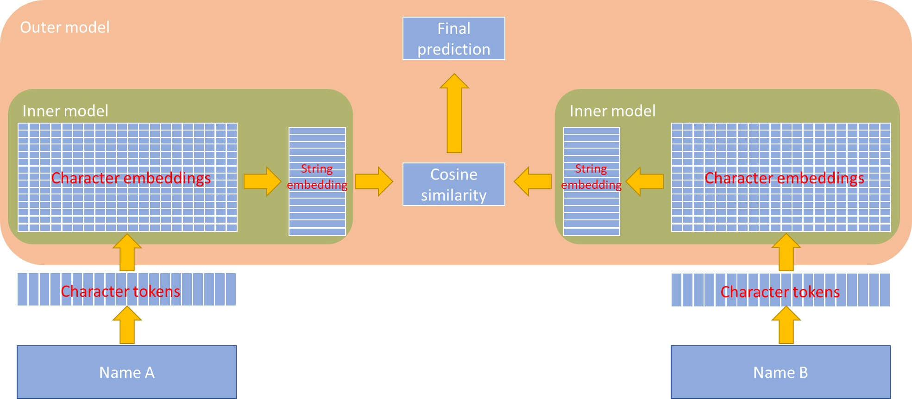
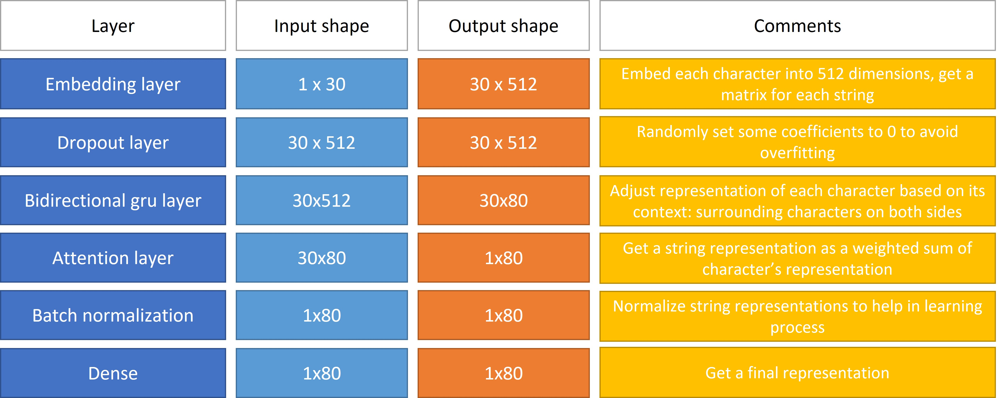

# Character level Bidirectionnal GRU model with attention

The goal of this prohect is to build an deep learning model that measures similarity of names of two individuals. I am doing this for my project at work, but I do not want to share the data that we are using, so for this repo I will prepare my own dataset using [Data from Open ICPSR](https://www.openicpsr.org/openicpsr/project/102000/version/V3/view). This is a list of all governors of all states in the USA.  
  
The model has to be able to handle misspellings, shold tolerate some alternations in the words order, for example "first name" + "second name" should be considered the same as "second name" + "first name" and ideally should be able to handle different writings of the same name, for example Bill = William or Stéphane = Etien.
  
So I will try to build a deep learning network described by [Chen Zhao and Yeye He](https://www.microsoft.com/en-us/research/uploads/prod/2019/04/Auto-EM.pdf) in tensorflow.
  
For the baseline model I will create a simple character model with attention that works only on character level without word-level attention.

## Preparing the data
The first step is to prepare the data. I will need to generate two sets:

1. positive matches. Pairs of names that represent the same person, therefore the distance should be 1
2. negative matches. Pairs of names that do not represent the same person, therefore the distance should be 0.
  
To generate positive matches I build a module that uses [wikidata api](https://www.wikidata.org/wiki/Wikidata:Data_access). I have built a class named "Synonym_finder" that given a string will try to search alternative spellings of this string asumming that this is a name or a surname. So I create a dictionary that fetches every word in my dataset to create a list of synonyms of each word i try to find.  
  
The next step is to create positive matches by using the original data and this dictionary. For each word in a name, we will try to replace it with a synonym and use one of the synonyms instead and then permutating word order in the given name.
  

## Seameese network
The main idea is that we need a network that will be generating some representation of a string. We will feet two strings into this network, pass them both though this network, obtain two representations (one for each string) and them compare them with some measure. The final prediction will be a linear function of this similarity. The overall architecture is presented in the figure below:  

  
I chose the following architecture for the inner model:


As a base model I will be using the approach proposed [here](https://github.com/amansrivastava17/lstm-siamese-text-similarity)

## Usage
First, we need to create an environment to run the code:
```bash
conda create --name <env_name> --file requirements.txt
conda activate <env_name>
```
The model has been pretrained with settings from `install_settings.py`. The latest weights are found here: `output_model\architecture_with_abs\`. This folder contains yml file with tokenizer as well as weights and tensorboard information. The model has been trained by batches (10 epochs per each epoch). The latest epoch is `output_model\architecture_with_abs\20210906-221827`.  
  
We can use the model with the following code:
```python
import numpy as np
from tokenizer import load_tokenizer
from instance_settings import inner_settings_1, outer_settings_1
from utils_model import load_model_from_checkpoint,compare_strings

np.set_printoptions(precision=4)
#load the tokenizer
tk = load_tokenizer("output_model\\architecture_with_abs\\tokenizer.json")

#load model
model = load_model_from_checkpoint(
    "output_model\\architecture_with_abs\\20210906-221827\\weights\\",
    inner_settings_1,
    outer_settings_1
)

#initialize and preprocess strings
my_test = [
    ["Boris Jonson","Borya Jonson"],
    ["Moris Jonson", "Boris Jonson"],
    ["Bill Clinton", "Bill Gates"],
    ["Bill Clinton", "William Clinton"]
]

for pair in my_test:
    compare_strings(pair,tk,model,debug=True,give_representations=False,echo=False)
```
Output:
```
Comparing 'Boris Jonson' and 'Borya Jonson'
Similarity: 0.9861
Prediction: 0.6604 => 1.0

Comparing 'Moris Jonson' and 'Boris Jonson'
Similarity: 0.5186
Prediction: 0.4860 => 0.0

Comparing 'Bill Clinton' and 'Bill Gates'
Similarity: 0.1354
Prediction: 0.3437 => 0.0

Comparing 'Bill Clinton' and 'William Clinton'
Similarity: 0.9439
Prediction: 0.6456 => 1.0
```
Prediction `0` means that the names are not the same, whereas prediction `1` means that the names match.

## Baseline performance
The model has been trained on very specific data, which is English names, so it may need additional training on your data. The final training batch of the model achieved the following results:
```
Epoch 1/10
184/184 - 58s - loss: 0.4694 - accuracy: 0.9438 - precision: 0.8860 - val_loss: 0.4628 - val_accuracy: 0.9418 - val_precision: 0.8809
Epoch 2/10
184/184 - 28s - loss: 0.4656 - accuracy: 0.9454 - precision: 0.8901 - val_loss: 0.4591 - val_accuracy: 0.9421 - val_precision: 0.8816
Epoch 3/10
184/184 - 27s - loss: 0.4617 - accuracy: 0.9456 - precision: 0.8910 - val_loss: 0.4553 - val_accuracy: 0.9424 - val_precision: 0.8827
Epoch 4/10
184/184 - 27s - loss: 0.4579 - accuracy: 0.9458 - precision: 0.8914 - val_loss: 0.4515 - val_accuracy: 0.9425 - val_precision: 0.8830
Epoch 5/10
184/184 - 28s - loss: 0.4542 - accuracy: 0.9465 - precision: 0.8930 - val_loss: 0.4478 - val_accuracy: 0.9433 - val_precision: 0.8848
Epoch 6/10
184/184 - 28s - loss: 0.4504 - accuracy: 0.9468 - precision: 0.8935 - val_loss: 0.4444 - val_accuracy: 0.9432 - val_precision: 0.8849
Epoch 7/10
184/184 - 28s - loss: 0.4468 - accuracy: 0.9471 - precision: 0.8945 - val_loss: 0.4408 - val_accuracy: 0.9441 - val_precision: 0.8864
Epoch 8/10
184/184 - 28s - loss: 0.4434 - accuracy: 0.9473 - precision: 0.8953 - val_loss: 0.4374 - val_accuracy: 0.9442 - val_precision: 0.8870
Epoch 9/10
184/184 - 28s - loss: 0.4397 - accuracy: 0.9480 - precision: 0.8962 - val_loss: 0.4338 - val_accuracy: 0.9442 - val_precision: 0.8868
Epoch 10/10
184/184 - 28s - loss: 0.4362 - accuracy: 0.9482 - precision: 0.8970 - val_loss: 0.4304 - val_accuracy: 0.9445 - val_precision: 0.8877
```
I chose accuracy and precision as my perofmance metrics. The good point is that both this metrics are pretty balanced for the training and validation data.