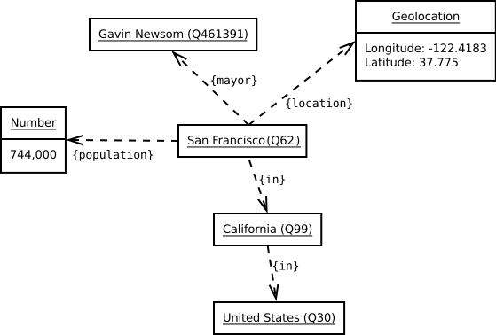
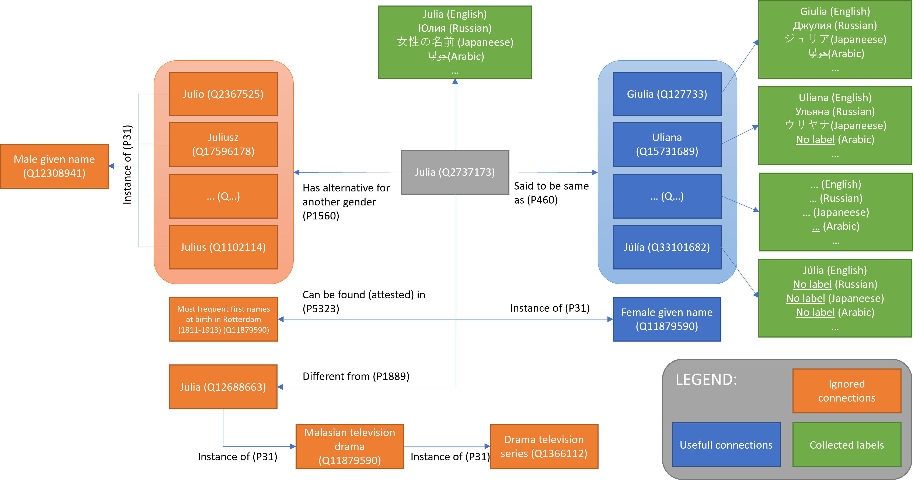
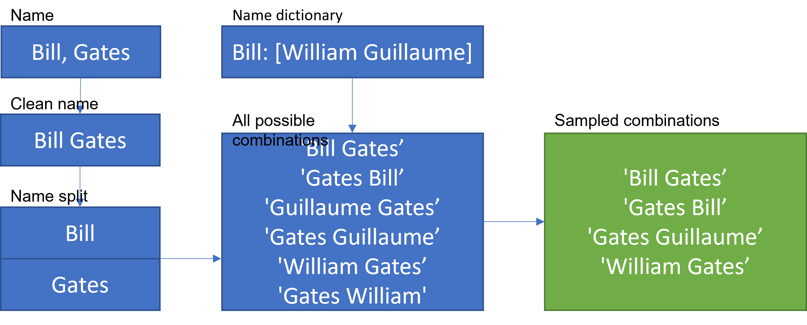
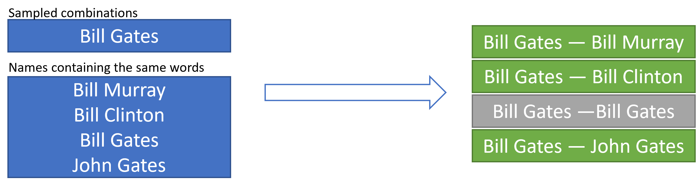

# Character level Bidirectionnal GRU model with attention

The goal of this prohect is to build an deep learning model that measures similarity of names of two individuals. I am doing this for my project at work, but I do not want to share the data that we are using, so for this repo I will prepare my own dataset using [Data from Open ICPSR](https://www.openicpsr.org/openicpsr/project/102000/version/V3/view). This is a list of all governors of all states in the USA.  
  
The model has to be able to handle misspellings, should tolerate some alternations in the words order, for example "first name" + "second name" should be considered the same as "second name" + "first name" and ideally should be able to handle different writings of the same name, for example Bill = William or Stéphane = Etien.
  
So I will try to build a deep learning network described by [Chen Zhao and Yeye He](https://www.microsoft.com/en-us/research/uploads/prod/2019/04/Auto-EM.pdf) in tensorflow.
  
For the baseline model I will create a simple character model with attention that works only on character level without word-level attention.

## Preparing the data
The first step is to prepare the data. I will need to generate two sets:

1. positive matches. Pairs of names that represent the same person, therefore the distance should be 1
2. negative matches. Pairs of names that do not represent the same person, therefore the distance should be 0.
  
To generate positive matches I build a module that uses [wikidata api](https://www.wikidata.org/wiki/Wikidata:Data_access). I have built a class named "Synonym_finder" that given a string will try to search alternative spellings of this string asumming that this is a name or a surname. So I create a dictionary that fetches every word in my dataset to create a list of synonyms of each word I try to find. More details about Synonyms finder are provided below.  
  
The next step is to create positive matches by using the original data and this dictionary. For each word in a name, we will try to replace it with a synonym and use one of the synonyms instead and then permutating word order in the given name.
  

## Synomyms finder
### Concept
We are using [Wikidata](https://www.wikidata.org/wiki/Wikidata:Main_Page) to search alternative spellings of names. Wiki is a collaboratively edited multilingual knowledge graph hosted by the Wikimedia Foundation. It is a common source of open data that Wikimedia projects such as Wikipedia, and anyone else, can use under the CC0 public domain license. This knowledge graph contains information between different terms. Each term has its unique identifier (Q...) that alows to build queries to the database.  
Here is an example of how terms are linked to San Francisco:
  
In our case we are interested in names. Let's say we are looking for different spellings of name Julia. Here is an example some information we may obtain when looking for Julia in wikidata:

Wikidata provides huge graphs for every term we may ask. The terms may be connected with different types of connections. They are called properties and have ids starting with P.... For example a link that `Julia is a female given name` would look like `element Q2737173 has a property P31 with value Q11879590`. More information about usage of wikidata can be found in [Wikidata tours](https://www.wikidata.org/wiki/Wikidata:Tours), which I encourage you to visit.  
  
In our case the task of finding alternative names becomes a task of carefully identifying proper links, idealy the ones being instance of any name class: male or female, given or family or any other and then taking their labels coming from all available languages if ones exit. For example we will ignore all alternatives gor another gender (P1560) or sources where the name can be found (P5323) and all links that lead to malasian television serias.  
  
We need to make sure that the first API call brings us to an item of a proper instance and we will also take a look at links of type "said to be the same as" (P460). This will give us a list of elements with their ids (Q...) that refer to the requested name (or surname). Once we have it, we check that these Qs are of type linked to names and then we take all labels for each identified element. Of course there will be a lot of identical labels, therefore we will need to keep only unique values.  
  
For the sake of simplicity of this project I kept only synonyms with latin characters. However the scope could be extended to other alphabets.
### Usage
Wikidata has a lot of different APIs that alow requesting different types of data. Realisation of this idea requires sending multiple requests to get synonyms of a single term. So I wrapped the whole algorythm in a class `SynonymsFinder` in `synonyms_finder_refacto.py` that is responsible for sending all requests and navigating in this environment.
```python
from time import time
from synonyms_finder_refacto import SynonymsFinder
from synonyms_finder_settings import GLOBAL_SETTINGS

def timeit(method):
    def timed(*args, **kw):
        ts = time()
        result = method(*args, **kw)
        te = time()
        print(f"Execution time: {(te - ts):2.2f} sec")
        return result

    return timed

@timeit
def test_one_name():
    name = "julia"
    syn = SynonymsFinder(name,GLOBAL_SETTINGS)
    syn.fit()
    print(syn.collect_labels())

test_one_name()
```
Output
```
{'julia': 
    ['Dzhuljeta', 'Džuljeta', 'Giulia', 'Giuliana', 'Giuliano', 'Giulietta', 'Hulya', 'Hülya', 'Illan', 'Illán', 'Ioulia', 'Iulia', 'Iuliana', 'Iúlia', 'JULIA', 'Joelia', 'Joelija', 'Jolie', 'Jule', 'Julee', 'Jules', 'Julia', 'Julian', 'Juliana', 'Juliane', 'Julianna', 'Julianne', 'Juliano', 'Julica', 'Julie', 'Julien', 'Julienne', 'Juliet', 'Julieta', 'Julieth', 'Julietta', 'Juliette', 'Julija', 'Julika', 'Julio', 'Julius', 'Julià', 'Julián', 'Jullian', 'Jullien', 'July', 'Julya', 'Júlia', 'Júlía', 'Jûlija', 'Jūlija', 'Liana', 'Liane', 'Lijana', 'Liyana', 'Ouliana', 'Schulieta', 'Shulieta', 'Uliana', 'Uljana', 'Yulia', 'Yuliya', 'Zhulieta', 'Ýuliýa', 'Γιούλια', 'Ζυλί', 'Ζυλιέν', 'Ιουλιέτα', 'Ιουλιανή', 'Τζουλ', 'Τζουλιάν', 'Τζουλιάνα', 'Τζούλια', 'Τζούλικα', 'Χιούλια', 'Ђулиано', 'Ђулија', 'Ђулијана', 'Імя Юлія', 'Јулика', 'Јулија', 'Џулија', 'Џулијет', 'Гюлія', 'Джул', 'Джули', 'Джулиан', 'Джулиана', 'Джулиано', 'Джулиус', 'Джулия', 'Джульен', 'Джульет', 'Джульета', 'Джульетта', 'Джульєтта', 'Джулі', 'Джулія', 'Жулиета', 'Жульєн', 'Жюли', 'Жюль', 'Жюльен', 'Жюльенн', 'Жюльенна ', 'Жюльетт', 'Жюльетта', 'Ильян', 'Иулия', 'Лиана', 'Лијана', 'Ліана', 'Ліяна', 'Ульяна', 'Уляна', 'Хулиан', 'Хулиана', 'Хулио', 'Хулија', 'Хульета', 'Хюлия', 'Юлиана', 'Юлианна', 'Юлианна / Джулианна', 'Юлика', 'Юлия', 'Юлия / Джулия / Хулия', 'Юліана', 'Юліанія', 'Юліка', 'Юліюс', 'Юлія', 'Җулия', 'Җүли', 'Һулия', 'Լիանա', 'Յուլիա', "ג'ולי", "ג'וליאן", "ג'וליה", "ז'יל", 'יוליאנה', 'יוליה', 'ליאן', 'جولي', 'جوليا', 'جوليان', 'جوليانا', 'جوليس', 'جولييت', 'جولیا', 'ليان', 'يوليا', 'ژولیت', 'یولیا', 'জিউলিয়া', 'জুলিকা', 'জুলিয়ানা', 'জুলিয়েটা', 'লিয়ানা', 'ยูลียา', 'ჯულიეტა', 'ᱞᱤᱭᱟᱱᱟ', 'ᱡᱩᱞᱤᱠᱟ', 'ᱡᱩᱞᱤᱭᱮᱴ', 'ウリヤナ', 'ジュリア', 'ジュリアス', 'ジュリアナ', 'ジュリアン', 'ジュリアーナ', 'ジュリアーノ', 'ジュリエッタ', 'ジュリエット', 'ジュリー', 'ジューリー', 'ユリア', 'ユリアンナ', 'ユリアーネ', 'ユリエ', 'ユーリア', 'リアナ', 'リアン', '利亚纳', '利安妮', '吉爾斯', '尤利娅', '尤利 婭', '尤利纳', '尤莉亞', '朱丽卡', '朱丽叶', '朱丽叶塔', '朱丽安妮', '朱丽安娜', '朱利亚', '朱利亚诺', '朱利亞諾', '朱利安', '朱利安諾', '朱利斯', '朱利歐', '朱勒', '朱尔斯', '朱莉', '朱莉亞', '朱莉娅', '朱莉娅娜', '朱莉安', '朱莉安娜', '烏里揚娜', '珠莉卡', '胡列塔', '胡利亚', '胡利奥', '胡利安', '胡莉雅', '茱樂', '茱莉亞', '茱莉婭', '茱莉婭娜', '茱莉安', '茱莉安妮', '茱莉安娜', '茱莉艾塔', '茱莉葉', '茱麗', '茱麗葉', '莉雅娜', '黎安', '율리야', '줄리', '줄리아', '줄리아나']}
Execution time: 44.74 sec
```
In our case, the finder will go trhough name items (instances of P31 and having link of type P460 (said to be the same)) in the result contained in the initial request and retrieve its information from WikiData. This will be done to names that have not been retrieved so far. Then it will retrieve name items contained in the child list and so on... Recurcive execution will continue until no new elements are discovered. For request "julia" the process will get repeated 4 times:
```
Ids captured ad level 0: ['Q10289970', 'Q1102036', 'Q11929439', 'Q127733', 'Q12900608', 
                          'Q141520', 'Q15639217', 'Q15725563', 'Q15731628', 'Q15731689', 
                          'Q1627850', 'Q16722683', 'Q1705088', 'Q1711631', 'Q1712302', 
                          'Q1712326', 'Q17631793', 'Q1822678', 'Q1822679', 'Q19689456', 
                          'Q19851095', 'Q21179009', 'Q288742', 'Q304837', 'Q33101682', 
                          'Q348252', 'Q351311', 'Q3549015', 'Q451762', 'Q59162109', 
                          'Q59162239', 'Q59163016', 'Q87958412', 'Q9097269']
Ids captured ad level 1: ['Q104836751', 'Q106158340', 'Q106158452', 'Q106159216', 
                          'Q106159353', 'Q1124155', 'Q1652291', 'Q20000410', 'Q20035791', 
                          'Q21448857', 'Q225030', 'Q22679860', 'Q22814348', 'Q2737173',
                          'Q29422660', 'Q56649801', 'Q59157060', 'Q59157114', 'Q59157156', 
                          'Q6308936', 'Q64431969', 'Q66309259', 'Q66309285', 'Q89144667']
Ids captured ad level 2: ['Q106158581', 'Q18609982', 'Q19902533', 'Q20000415', 'Q21489043', 
                          'Q26780677', 'Q3189129', 'Q4160543', 'Q47528310', 'Q48718994', 
                          'Q6308633']
Ids captured ad level 3: ['Q1713171', 'Q24698962', 'Q36899945']
Ids captured ad level 4: []
```
In our case the finder found 3 Qs at the first level: 'Q225030', 'Q15731614', 'Q2737173'. Each of these Qs has a group of connections of P460 (said to be the same). Their Qs are simply not included in the output. Then once the whole list of Qs is identified, the algorythm sends a request for labels for each of identified qs. The final list of possible writings of the name is aggregated in synonyms list.  
  
Execution time depends on the numer of request we need to send per name, but can take quite a while. Since this is an IO bounded operation, meaning that the most of this time the CPU is not performing computations, but waiting for an answer from wikidata, we could use multi threading to perform this kind of operation. The `SynonymsFinder` class supports multiple threading
```python
from synonyms_finder_refacto import SynonymsFinder
from synonyms_finder_settings import GLOBAL_SETTINGS

def parse_names(names,threadLimiter=None):
    '''Function parses a list of names. Each name is parsed in a separate thread
    '''
    threads = []
    for name in names:
        req = SynonymsFinder(name,GLOBAL_SETTINGS,threadLimiter=threadLimiter)
        req.start()
        threads.append(req)

    return_dict = {}
    for res in threads:
        res.join()
        return_dict.update(res.collect_labels())
    return return_dict

@timeit
def test_several_names():
    names = ["Bill","George","Michael","John","Gregory"]
    maximumNumberOfThreads = 5
    threadLimiter = BoundedSemaphore(maximumNumberOfThreads)
    names_dict = parse_names(names,threadLimiter)
    print(f"names_dict contains {len(names_dict)} elements.")

test_several_names()
```
Output
```
Done with Bill
Done with Gregory
Done with George
Done with Michael
Done with John
names_dict contains 5 elements.
Execution time: 46.02 sec
```
The final think will be to pass every word in every unique name in the gouvernor list trhough synonyms finder and obtain a large dictionary of synonyms stored in `data\dict\names.json`.
## Training dataset
Now that we have all the names synonyms set up we can move on to create the training dataset. We need a labeled dataset containing true matches and false matches. We will prepare each part separately.
### True match
For true match I have created a class `TrueSynonymsGenerator` which is responsible for generating and sampling of true permutations based on the provided name and the dictionary. In general, it does some cleaning, then splits the name into words, tries to search for alternatives for each of them and then generates permutations of these alternatives. This class has a method sample that samples from possible combinations (permutations) of words. If the number of samples is not provided, it takes all possible combinations.
TrueSynonymsGenerator's structure is presented below:


```python
from true_combinations_generator import TrueSynonymsGenerator

test_name = "Bill,. Gates Geferson"
test_dict = {"Bill": ["William","Guillaume"]}

test_gen = TrueSynonymsGenerator(test_name)
test_gen.fit(test_dict)
test_gen.sample()
print(f"Number of all possible combinations: {len(test_gen.combinations)}")
print(f"Number of selected combinations {len(test_gen.selected_combinations)}")
print(repr(test_gen))
```
Output:
```
Number of all possible combinations: 18
Number of selected combinations 18
TrueSynonymsGenerator(
    name='Bill,. Gates Geferson', 
    clean_name='Bill Gates Geferson', 
    name_split=['Bill', 'Gates', 'Geferson'], 
    combinations=[
        'William Gates Geferson', 'William Geferson Gates', 'Gates William Geferson', 
        'Gates Geferson William', 'Geferson William Gates', 'Geferson Gates William', 
        'Bill Gates Geferson', 'Bill Geferson Gates', 'Gates Bill Geferson', 
        'Gates Geferson Bill', 'Geferson Bill Gates', 'Geferson Gates Bill', 
        'Guillaume Gates Geferson', 'Guillaume Geferson Gates', 
        'Gates Guillaume Geferson', 'Gates Geferson Guillaume', 
        'Geferson Guillaume Gates', 'Geferson Gates Guillaume'
    ], 
    selected_combinations=[
        'William Gates Geferson', 'William Geferson Gates', 'Gates William Geferson', 
        'Gates Geferson William', 'Geferson William Gates', 'Geferson Gates William', 
        'Bill Gates Geferson', 'Bill Geferson Gates', 'Gates Bill Geferson', 
        'Gates Geferson Bill', 'Geferson Bill Gates', 'Geferson Gates Bill', 
        'Guillaume Gates Geferson', 'Guillaume Geferson Gates', 'Gates Guillaume Geferson', 
        'Gates Geferson Guillaume', 'Geferson Guillaume Gates', 'Geferson Gates Guillaume'
    ]
)
```

### False match
Generation of false matches is much simpler. We simply split the name into words and search for other names containing at least one of the words from the original name. Full matches are excluded.

## Seameese network
The main idea is that we need a network that will be generating some representation of a string. We will feet two strings into this network, pass them both though this network, obtain two representations (one for each string) and them compare them with some measure. The final prediction will be a linear function of this similarity. The overall architecture is presented in the figure below:  

  
I chose the following architecture for the inner model:


As a base model I will be using the approach proposed [here](https://github.com/amansrivastava17/lstm-siamese-text-similarity)

## Usage
First, we need to create an environment to run the code:
```bash
conda create --name <env_name> --file requirements.txt
conda activate <env_name>
```
The model has been pretrained with settings from `install_settings.py`. The latest weights are found here: `output_model\architecture_with_abs\`. This folder contains yml file with tokenizer as well as weights and tensorboard information. The model has been trained by batches (10 epochs per each batch). The latest batch is `output_model\architecture_with_abs\20210906-221827`.  
  
We can use the model with the following code:
```python
import numpy as np
from tokenizer import load_tokenizer
from instance_settings import inner_settings_1, outer_settings_1
from utils_model import load_model_from_checkpoint,compare_strings

np.set_printoptions(precision=4)
#load the tokenizer
tk = load_tokenizer("output_model\\architecture_with_abs\\tokenizer.json")

#load model
model = load_model_from_checkpoint(
    "output_model\\architecture_with_abs\\20210906-221827\\weights\\",
    inner_settings_1,
    outer_settings_1
)

#initialize and preprocess strings
my_test = [
    ["Boris Jonson","Borya Jonson"],
    ["Moris Jonson", "Boris Jonson"],
    ["Bill Clinton", "Bill Gates"],
    ["Bill Clinton", "William Clinton"]
]

for pair in my_test:
    compare_strings(pair,tk,model,debug=True,give_representations=False,echo=False)
```
Output:
```
Comparing 'Boris Jonson' and 'Borya Jonson'
Similarity: 0.9861
Prediction: 0.6604 => 1.0

Comparing 'Moris Jonson' and 'Boris Jonson'
Similarity: 0.5186
Prediction: 0.4860 => 0.0

Comparing 'Bill Clinton' and 'Bill Gates'
Similarity: 0.1354
Prediction: 0.3437 => 0.0

Comparing 'Bill Clinton' and 'William Clinton'
Similarity: 0.9439
Prediction: 0.6456 => 1.0
```
Prediction `0` means that the names are not the same, whereas prediction `1` means that the names match.

## Baseline performance
The model has been trained on very specific data, which is English names, so it may need additional training on your data. The final training batch of the model achieved the following results:
```
Epoch 1/10
184/184 - 58s - loss: 0.4694 - accuracy: 0.9438 - precision: 0.8860 - val_loss: 0.4628 - val_accuracy: 0.9418 - val_precision: 0.8809
Epoch 2/10
184/184 - 28s - loss: 0.4656 - accuracy: 0.9454 - precision: 0.8901 - val_loss: 0.4591 - val_accuracy: 0.9421 - val_precision: 0.8816
Epoch 3/10
184/184 - 27s - loss: 0.4617 - accuracy: 0.9456 - precision: 0.8910 - val_loss: 0.4553 - val_accuracy: 0.9424 - val_precision: 0.8827
Epoch 4/10
184/184 - 27s - loss: 0.4579 - accuracy: 0.9458 - precision: 0.8914 - val_loss: 0.4515 - val_accuracy: 0.9425 - val_precision: 0.8830
Epoch 5/10
184/184 - 28s - loss: 0.4542 - accuracy: 0.9465 - precision: 0.8930 - val_loss: 0.4478 - val_accuracy: 0.9433 - val_precision: 0.8848
Epoch 6/10
184/184 - 28s - loss: 0.4504 - accuracy: 0.9468 - precision: 0.8935 - val_loss: 0.4444 - val_accuracy: 0.9432 - val_precision: 0.8849
Epoch 7/10
184/184 - 28s - loss: 0.4468 - accuracy: 0.9471 - precision: 0.8945 - val_loss: 0.4408 - val_accuracy: 0.9441 - val_precision: 0.8864
Epoch 8/10
184/184 - 28s - loss: 0.4434 - accuracy: 0.9473 - precision: 0.8953 - val_loss: 0.4374 - val_accuracy: 0.9442 - val_precision: 0.8870
Epoch 9/10
184/184 - 28s - loss: 0.4397 - accuracy: 0.9480 - precision: 0.8962 - val_loss: 0.4338 - val_accuracy: 0.9442 - val_precision: 0.8868
Epoch 10/10
184/184 - 28s - loss: 0.4362 - accuracy: 0.9482 - precision: 0.8970 - val_loss: 0.4304 - val_accuracy: 0.9445 - val_precision: 0.8877
```
I chose accuracy and precision as my perofmance metrics. The good point is that both this metrics are pretty balanced for the training and validation data.